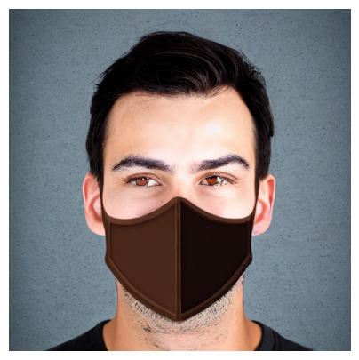

# Anime-style Stable Diffusion!

Ever wanted to generate images of a particular style with the current state of the art stable diffusion models? With this repo, you can generate all types of styles.


<table style="width: 100%; border-collapse: separate; border-spacing: 20px;">
  <tr>
    <td style="text-align: center;">
      
      <br/>
      <span style="display: block; margin-top: 5px;">Caption for the image</span>
    </td>
    <td style="text-align: center;">
      
      <br/>
      <span style="display: block; margin-top: 5px;">Caption for the image</span>
    </td>
    <td style="text-align: center;">
      
      <br/>
      <span style="display: block; margin-top: 5px;">Caption for the image</span>
    </td>
    <td style="text-align: center;">
      
      <br/>
      <span style="display: block; margin-top: 5px;">Caption for the image</span>
    </td>
<table style="width: 100%; border-collapse: separate; border-spacing: 20px;">
  <tr>
    <td style="text-align: center;">
      
      <br/>
      <span style="display: block; margin-top: 5px;">Caption for the image</span>
    </td>
    <td style="text-align: center;">
      
      <br/>
      <span style="display: block; margin-top: 5px;">Caption for the image</span>
    </td>
  </tr>
</table>

  </tr>
</table>


## You can run the model locally in the following ways: TODO
* Install dependencies

```python
def hello_world():
    print("Hello, world!")
```

* Run hello_world.py
```python
python3 hello_world.py
```

## Enjoy!
