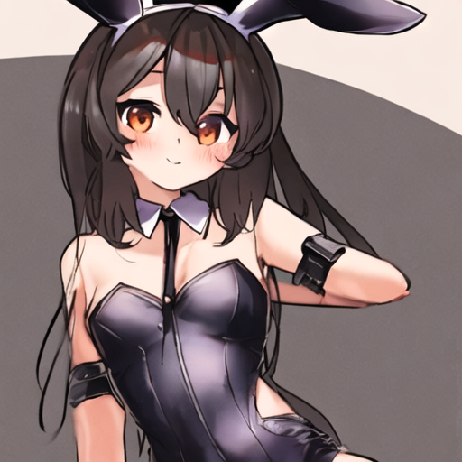
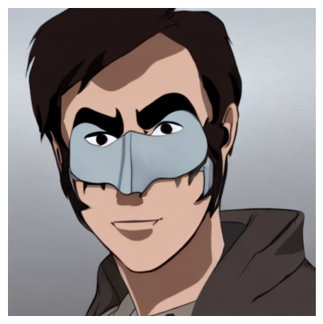
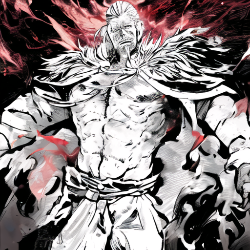
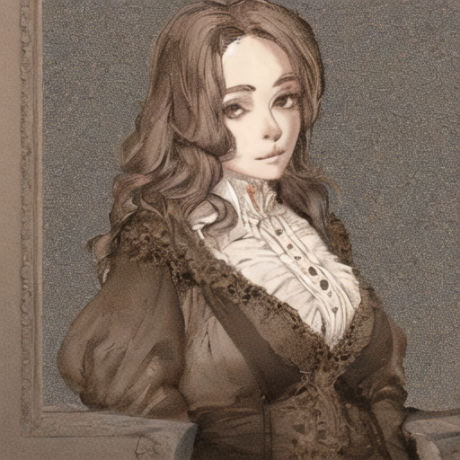
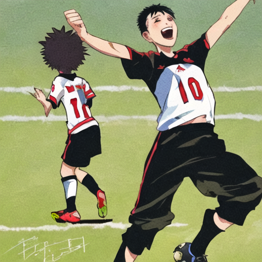
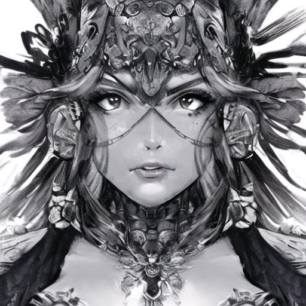

# Anime-style Stable Diffusion!

Ever wanted to generate images of a particular style with the current state of the art stable diffusion models? With this repo, you can generate all types of styles.


<table style="width: 100%; border-collapse: separate; border-spacing: 20px;">
  <tr>
    <td style="text-align: center;">
      
      <br/>
      <span style="display: block; margin-top: 5px;">Girl with bunny ears</span>
    </td>
    <td style="text-align: center;">
      
      <br/>
      <span style="display: block; margin-top: 5px;">A man wearing a mask</span>
    </td>
    <td style="text-align: center;">
      
      <br/>
      <span style="display: block; margin-top: 5px;">A powerful man with fire around his body.</span>
    </td>
    <td style="text-align: center;">
      
      <br/>
      <span style="display: block; margin-top: 5px;">An old portrait of a woman</span>
    </td>
<table style="width: 100%; border-collapse: separate; border-spacing: 20px;">
  <tr>
    <td style="text-align: center;">
      
      <br/>
      <span style="display: block; margin-top: 5px;">Two boys celebrating a soccer goal</span>
    </td>
    <td style="text-align: center;">
      
      <br/>
      <span style="display: block; margin-top: 5px;">A portrait of a blonde man</span>
    </td>
    <td style="text-align: center;">
      
      <br/>
      <span style="display: block; margin-top: 5px;">A powerful female warrior</span>
    </td>

  </tr>
</table>

  </tr>
</table>


## Run the model locally:

* Install dependencies
```python
git clone https://github.com/RSDP101/Anime-SD.git
pip install virtualenv
python -m venv venv
source venv/bin/activate
cd Anime-SD/examples/text_to_image/
pip install git+https://github.com/huggingface/diffusers.git
pip install -U -r requirements.txt
accelerate config default
```

* Run training on a SD model and dataset. The default ones are 'CompVis/stable-diffusion-v1-4' and rod101/Anime1K.
```python
# Change model and dataset configuration at the training.py script.
python3 training.py
```

Training will save model's weight to sd-anime-model.

Change model and dataset configuration at the training.py script.
Pass the prompt you want to generate at the inference.py script

* Run inference on your fine-tuned model.
```python
python3 inference.py
```

## Enjoy!
